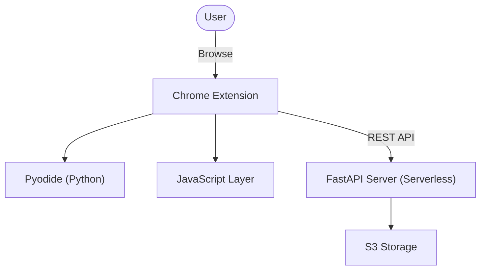
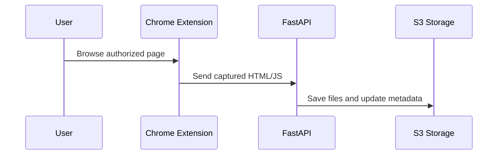

# Architecture Diagrams

The following Mermaid diagrams illustrate the high-level architecture and data flow of the **Chrome Extension Website Proxy** project.

## High-Level Components

## Data Flow

